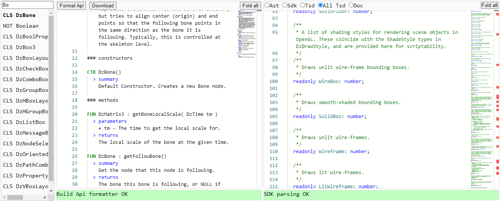

Defintions typescript pour les scripts du logiciel [Daz3d](https://www.daz3d.com/)

En dehors du fichier [daz.d.ts](./daz.d.ts), tout le reste est une interface d'édition pour générer ce fichier.

C'est loin d'être parfait. Il y a un certain nombre d'erreurs dans le fichier généré.
Cela est dû au manque d'informations dans la documentation de Daz ainsi que dans son SDK, de plus le logiciel utilise (via Qt) une version javascript vieille de 10 ans basée sur WebKit.

---

L'interface d'édition est accessible en ligne à des fins de test.

https://corbane.github.io/daz.d.ts/index.html

